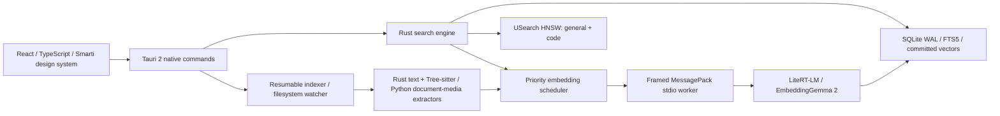

# Architecture

The frontend owns presentation and input. Rust owns file identity, roots, exclusions, jobs, SQLite, ANN, ranking, cancellation and Windows file operations. The worker owns bounded decoding, document extraction and real native inference. No public localhost API is started.

Filename/path matching and FTS return before the separately debounced semantic pass. Search requests have monotonic IDs; stale semantic work is rejected before inference and stale UI responses are discarded. Existing indexed-file similarity reuses committed embeddings.

Discovery records metadata without reading file content. Files are queued in text, code, document, image, audio, video order. Content hashing is streamed. Chunk hashes reuse vectors when content survives an edit. Changes commit all replacement chunks/vectors in a single SQLite transaction; ANN follows the committed transaction. Startup verifies ANN checkpoints and reconstructs them from SQLite if needed.

Windows notifications are debounced for 500ms, with existing paths processed before removals so renames retain file identity and vectors. A readable unchanged NTFS USN journal skips enumeration. Changed/unavailable journals and other volumes trigger asynchronous metadata reconciliation; periodic reconciliation repairs missed watcher events. This does not re-embed unchanged content. Journal record replay is not implemented.

Pause and stop persist pending jobs. Active jobs resume after a process restart. Destructive operations synchronize with the current file job. A disconnected root is marked offline, rather than deleting its files. Search remains available during indexing.

Semantic settings, vector invalidation and rebuild jobs commit in one SQLite transaction. Replacement ANN instances are allocated before changing the native model; failed persistence restores the previous model configuration and leaves the previous index intact. Search and configuration changes synchronize so a query cannot mix embedding dimensions. Committed settings events update both the main and Quick Search WebViews. Native shortcut/registry/menu changes are restored if settings cannot be committed.
